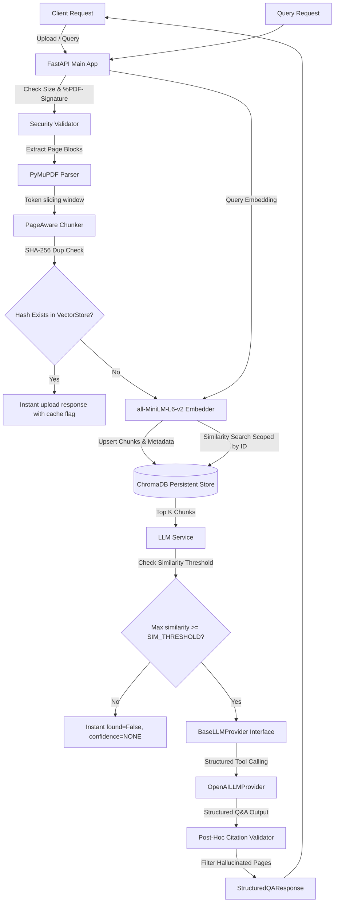

# Production-Grade RAG PDF Q&A Service

A production-grade, highly optimized FastAPI backend for Retrieval-Augmented Generation (RAG) Q&A over PDF documents. This service parses PDF documents page-by-page, generates semantic token-aware chunks, embeds text locally using `all-MiniLM-L6-v2`, stores vectors in ChromaDB, and performs structured tool-calling Q&A using OpenAI `gpt-4o-mini` with post-hoc citation validation.

---

## Pipeline Architecture



---

## Folder Structure

```
ai_qa_service/
  app/
    core/
      config.py          # Settings validation & env loading via Pydantic Settings
      logging.py         # Structured JSON logging with contextvars tracing
      middleware.py      # Tracing request ID middleware
      security.py        # File size and binary magic bytes validation
    models/
      schemas.py         # Pydantic v2 schemas with examples
    services/
      pdf_parser.py      # PDF text extraction with PyMuPDF
      chunker.py         # Page-aware token sliding chunker
      embedder.py        # Local sentence-transformers (all-MiniLM-L6-v2) embedding
      vector_store.py    # Persistent ChromaDB client wrapper
      llm_provider.py    # LLM provider ABC and OpenAI tool calling
      llm_service.py     # Prompt formatting, threshold checks, citation checks
    main.py              # Main FastAPI application and exception mapping
  docs/
    architecture.md      # Architecture design, diagrams, and trade-offs
    prompts.md           # Prompt versioning, details, and caught AI mistakes
    tradeoffs.md         # Detailed architectural trade-offs
  tests/
    test_e2e_pipeline.py # 8 end-to-end integration tests
  Dockerfile             # Multi-stage Docker build under 500MB
  docker-compose.yml     # local developer compose deployment
  .env.example           # template for environment variables
  requirements.txt       # pinned python dependencies
  README.md              # Setup and usage guide
```

---

## Installation & Setup

### Prerequisites
- Python 3.11+
- Pip and Virtualenv

### Local Setup
1.  **Clone the repository** and navigate to the project directory:
    ```bash
    cd "AI Q&A Service"
    ```
2.  **Create and activate a virtual environment**:
    ```bash
    python -m venv venv
    # Windows:
    .\venv\Scripts\activate
    # macOS/Linux:
    source venv/bin/activate
    ```
3.  **Install dependencies**:
    ```bash
    pip install -r requirements.txt
    ```
4.  **Set up environment variables**:
    Copy `.env.example` to `.env` and fill in your OpenAI API Key:
    ```bash
    cp .env.example .env
    ```
5.  **Start the application locally**:
    ```bash
    uvicorn app.main:app --reload
    ```
    The service will start at `http://localhost:8000`. Swagger documentation is available at `http://localhost:8000/docs`.

---

## Running with Docker

You can run the entire backend using Docker Compose in a single command. It will build the multi-stage image and mount `./chroma_data` on the host to persist vector indexes.

1.  Create a `.env` file in the root directory containing your `OPENAI_API_KEY`.
2.  Run Docker Compose:
    ```bash
    docker compose up --build
    ```
3.  The API will be available at `http://localhost:8000`.

---

## API Reference

Every API endpoint responds with the `X-Request-ID` header. If exceptions occur, they return structured JSON errors with a custom `error` and `message` payload.

### 1. Health Check
Checks system readiness, including vector database connectivity and LLM configurations.

-   **Route**: `GET /health`
-   **Example Request**:
    ```bash
    curl -X GET http://localhost:8000/health
    ```
-   **Example Response**:
    ```json
    {
      "status": "healthy",
      "vector_db": "connected",
      "embedding_model": "loaded",
      "llm": "configured"
    }
    ```

### 2. Upload Document
Uploads, parses, chunks, and indexes a PDF document. Bypasses calculations instantly if the document has already been processed (using SHA-256 hashes).

-   **Route**: `POST /api/v1/documents`
-   **Content-Type**: `multipart/form-data`
-   **Example Request**:
    ```bash
    curl -X POST http://localhost:8000/api/v1/documents \
      -F "file=@sample.pdf"
    ```
-   **Example Response (New Document)**:
    ```json
    {
      "document_id": "doc_e4c5b367d8f9",
      "filename": "sample.pdf",
      "upload_time": "2026-07-10T12:00:00Z",
      "hash": "8f3d1b6a7c8e4f2ab0d3e2f1b0a9f8e7d8f3d1b6a7c8e4f2ab0d3e2f1b0a9f8e",
      "file_size": 102400,
      "pages": 5,
      "chunks": 12,
      "embedding_model": "all-MiniLM-L6-v2",
      "processing_time_ms": 1095,
      "metrics": {
        "parse_time_ms": 120,
        "chunking_time_ms": 15,
        "embedding_time_ms": 850,
        "indexing_time_ms": 110,
        "total_time_ms": 1095
      }
    }
    ```
-   **Example Response (Duplicate Document - Deduplication)**:
    ```json
    {
      "document_id": "doc_e4c5b367d8f9",
      "filename": "sample.pdf",
      "upload_time": "2026-07-10T12:00:00Z",
      "hash": "8f3d1b6a7c8e4f2ab0d3e2f1b0a9f8e7d8f3d1b6a7c8e4f2ab0d3e2f1b0a9f8e",
      "file_size": 102400,
      "pages": 5,
      "chunks": 12,
      "embedding_model": "all-MiniLM-L6-v2",
      "processing_time_ms": 2,
      "metrics": {
        "parse_time_ms": 0,
        "chunking_time_ms": 0,
        "embedding_time_ms": 0,
        "indexing_time_ms": 0,
        "total_time_ms": 2
      }
    }
    ```

### 3. List Documents
Lists metadata for all documents registered in the system.

-   **Route**: `GET /api/v1/documents`
-   **Example Request**:
    ```bash
    curl -X GET http://localhost:8000/api/v1/documents
    ```
-   **Example Response**:
    ```json
    [
      {
        "document_id": "doc_e4c5b367d8f9",
        "filename": "sample.pdf",
        "upload_time": "2026-07-10T12:00:00Z",
        "hash": "8f3d1b6a7c8e4f2ab0d3e2f1b0a9f8e7d8f3d1b6a7c8e4f2ab0d3e2f1b0a9f8e",
        "file_size": 102400,
        "pages": 5,
        "chunks": 12,
        "embedding_model": "all-MiniLM-L6-v2"
      }
    ]
    ```

### 4. Query Document
Runs semantic similarity search over a document and queries the LLM using forced tool schemas with post-hoc citation validation.

-   **Route**: `POST /api/v1/documents/{document_id}/query`
-   **Example Request**:
    ```bash
    curl -X POST http://localhost:8000/api/v1/documents/doc_e4c5b367d8f9/query \
      -H "Content-Type: application/json" \
      -d '{"query": "What is the maximum file size?"}'
    ```
-   **Example Response (Answer Found)**:
    ```json
    {
      "answer": "The maximum file size supported by this backend is 10MB (10485760 bytes).",
      "citations": [
        {
          "page_number": 1,
          "excerpt": "Maximum allowed file size is 10MB."
        }
      ],
      "found": true,
      "confidence": "HIGH"
    }
    ```

### 5. Error Responses
All exceptions follow a structured output contract:

-   **Example 413 Response (File Too Large)**:
    ```json
    {
      "error": "FILE_TOO_LARGE",
      "message": "Uploaded file exceeds the maximum allowed size of 10.0MB."
    }
    ```
-   **Example 400 Response (Scanned PDF / OCR Not Supported)**:
    ```json
    {
      "error": "OCR_NOT_SUPPORTED",
      "message": "Uploaded PDF contains no extractable text. Please upload a searchable PDF (OCR is not supported by this backend)."
    }
    ```

---

## Testing

Run the integration test suite (incorporating 8 comprehensive tests):
```bash
$env:PYTHONPATH="ai_qa_service"; python -m pytest tests/test_e2e_pipeline.py -v
```
*(Tests utilize an autouse fixture to reset ChromaDB between executions and a Mock LLM Provider to run instantly without requiring a valid OpenAI key).*
