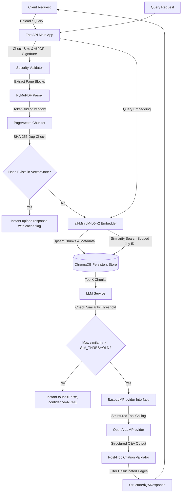

# System Architecture & Design Decisions

This document details the architectural design and software engineering trade-offs made in the RAG PDF Q&A Service.

## Data & Request Flow Diagram

---

## Key Design Decisions

### 1. Pluggable `LLMProvider` Interface
To satisfy clean software design principles and avoid coupling the RAG logic to OpenAI, we introduced the `BaseLLMProvider` abstract interface:
- **Abstraction**: Defines a standard method `generate_response` that receives system prompts, instruction prompts, and a Pydantic schema class.
- **Implementations**: `OpenAILLMProvider` is the default concrete implementation enforcing structured tool calling. In the future, this interface can be extended to support Anthropic, Cohere, local Llama instances, or Ollama without modifying `LLMService` or the routes.

### 2. Stateless Scaling: No In-Memory Rate Limiting
In a production cloud environment, FastAPI instances are deployed behind load balancers and scale horizontally. We deliberately removed in-memory rate limiting because:
- **Instance Isolation**: In-memory state (like client IP lookup dictionaries) is isolated to a single Python process. If a client sends 10 requests split across 5 stateless pods, the rate limiter would not calculate the total rate correctly.
- **Production Standard**: Rate limiting should be handled at the **API Gateway/Ingress layer** (e.g., Nginx, Cloudflare, AWS API Gateway) or centralized via a Redis store using a token bucket algorithm.

### 3. Direct Vector Retrieval vs. Local Sorting
We removed the concept of retrieving a larger pool of candidates and doing a local cosine-similarity rerank:
- **Accuracy**: ChromaDB already calculates and orders vectors using HNSW cosine distance natively. Performing a secondary cosine sort on the same embeddings locally adds CPU overhead without improving the retrieval ranking.
- **Pluggability**: If we want to add reranking in the future, it should use a proper deep-learning cross-encoder model (e.g., `bge-reranker-large`) that computes actual semantic relevance rather than redundant vector math.

### 4. SHA-256 Deduplication
Before parsing and vectorizing a document, we calculate its SHA-256 hash. If the hash exists in ChromaDB chunk metadata, we reuse the existing `document_id`. This saves storage, avoids redundant LLM cost/embedding cycles, and speeds up duplicate uploads to $\approx 2\text{ms}$.

### 5. Post-Hoc Citation Verification
LLMs are prone to hallucinating page numbers in structured responses. To mitigate this:
- We collect the page numbers from all chunks retrieved from the database.
- We check every citation returned by the LLM. If `citation.page_number` is not in the set of retrieved pages, we log the caught mistake and strip it from the output returned to the user, preventing false assurances.
